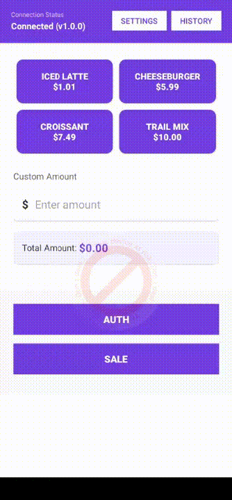

# TaplinkDemo

SUNBAY Taplink SDK 支付集成演示应用，展示如何集成和使用 SUNBAY Taplink SDK 进行支付交易处理。

> 🚀 **快速体验**: 下载 [APK文件](app/debug/TaplinkDemo-debug-1.0.0.apk) 直接安装，或观看演示视频了解功能

## 项目介绍

TaplinkDemo 是由商米提供的支付 SDK 集成示例应用，演示如何使用 Taplink SDK 在 Android 应用中实现各种支付交易功能。该应用采用原生 Android 开发方式，使用 XML 布局和基于 Activity 的架构。

### 📦 演示资源说明

本项目提供了完整的演示资源，方便开发者快速了解和体验：

- **[TaplinkDemo-debug-1.0.0.apk](app/debug/TaplinkDemo-debug-1.0.0.apk)** - 预编译的演示应用
  - 可直接安装在 Android 7.1+ 设备上
  - 包含完整的支付功能演示
  - 支持 App-to-App 模式连接

- **功能演示**: 



> 📹 **演示说明**: 
> - 上方GIF展示了完整的应用操作流程
> - 如需查看高清版本，可下载 [完整视频文件](./taplinkdemo.mp4)
> - GIF自动循环播放，展示主要功能操作

  - 展示完整的支付流程操作
  - App-to-App 模式连接演示
  - 交易历史和详情查看

## 功能特性

### 支付交易功能
- **销售交易 (SALE)** - 标准支付交易
- **预授权交易 (AUTH)** - 预授权交易
- **查询交易 (QUERY)** - 根据请求ID查询交易状态
- **批次结算 (BATCH_CLOSE)** - 日终批次结算
- **退款交易 (REFUND)** - 退款操作
- **撤销交易 (VOID)** - 交易撤销
- **预授权完成 (POST_AUTH)** - 预授权完成
- **增量授权 (INCREMENTAL_AUTH)** - 增量授权
- **小费调整 (TIP_ADJUST)** - 小费金额调整

### 连接模式
- **App-to-App 模式** - 同设备集成（已实现）
- **Cable 模式** - USB线缆连接（接口预留）
- **LAN 模式** - 局域网连接（接口预留）
- **Cloud 模式** - 云端连接（接口预留）

### 技术特性
- 原生 Android UI，使用 XML 布局
- 基于 Activity 的架构设计
- Kotlin 协程异步处理
- 交易历史记录管理
- 连接配置管理
- 实时支付状态更新
- 智能重试机制
- 错误处理和恢复
- 交易金额详情支持（附加费、小费、税费、返现、服务费）

## 技术栈

### 开发环境
- **Kotlin**: 2.2.21
- **Android Gradle Plugin**: 8.13.1
- **Compile SDK**: 35
- **Min SDK**: 25
- **Target SDK**: 35
- **JVM Target**: 11

### 核心依赖
- **Taplink SDK**: 1.0.1-SNAPSHOT
- **AndroidX Core KTX**: 1.16.0
- **AndroidX AppCompat**: 1.7.1
- **Material Components**: 1.12.0
- **ConstraintLayout**: 2.1.4
- **Kotlin Coroutines**: 1.8.1
- **Lifecycle Runtime KTX**: 2.9.2
- **Gson**: 2.13.1

## 项目结构

```
app/src/main/java/com/sunmi/tapro/taplink/demo/
├── TaplinkDemoApplication.kt          # 应用程序类
├── activity/                          # Activity 实现
│   ├── MainActivity.kt               # 主页面 - 支付交易
│   ├── ConnectionActivity.kt         # 连接配置
│   ├── TransactionListActivity.kt    # 交易历史列表
│   └── TransactionDetailActivity.kt  # 交易详情页面
├── adapter/                          # 列表适配器
│   └── TransactionAdapter.kt         # 交易列表适配器
├── model/                            # 数据模型
│   ├── Transaction.kt                # 交易记录模型
│   ├── TransactionType.kt            # 交易类型枚举
│   └── TransactionStatus.kt          # 交易状态枚举
├── repository/                       # 数据仓库
│   └── TransactionRepository.kt      # 交易数据管理
├── service/                          # SDK 集成层
│   ├── PaymentService.kt             # 支付服务接口
│   └── AppToAppPaymentService.kt     # App-to-App 支付实现
└── util/                             # 工具类
    ├── ConnectionPreferences.kt      # 连接配置管理
    ├── ErrorHandler.kt               # 错误处理工具
    └── RetryManager.kt               # 重试管理器
```

### 资源目录结构

```
app/src/main/res/
├── layout/                           # XML 布局文件
│   ├── activity_main.xml             # 主页面布局
│   ├── activity_connection.xml       # 连接配置布局
│   ├── activity_transaction_list.xml # 交易列表布局
│   ├── activity_transaction_detail.xml # 交易详情布局
│   ├── item_transaction.xml          # 交易列表项布局
│   └── dialog_additional_amounts.xml # 附加金额对话框布局
├── values/                           # 资源值
│   ├── strings.xml                   # 字符串资源
│   ├── colors.xml                    # 颜色资源
│   ├── themes.xml                    # 主题配置
│   ├── arrays.xml                    # 数组资源
│   └── config.xml                    # SDK 配置
└── drawable/                         # 图像资源
```

## 演示资源

### 📱 APK 下载
- **演示应用APK**: [TaplinkDemo-debug-1.0.0.apk](app/debug/TaplinkDemo-debug-1.0.0.apk)
  - 版本: 1.0.0 Debug
  - 最小SDK: 25 (Android 7.1)
  - 目标SDK: 35 (Android 15)
  - 直接安装即可体验完整功能

## 快速开始

### 环境要求
- Android Studio Ladybug | 2024.2.1 或更高版本
- JDK 11 或更高版本
- Android SDK 35
- Gradle 8.x

### 构建步骤

1. **克隆项目**
```bash
git clone <repository-url>
cd TaplinkDemo
```

2. **配置本地环境**
确保 `local.properties` 文件包含正确的 SDK 路径：
```properties
sdk.dir=/path/to/your/Android/sdk
```

3. **同步依赖**
在 Android Studio 中打开项目，等待 Gradle 同步完成。

4. **构建项目**
```bash
./gradlew build
```

5. **运行应用**
```bash
./gradlew installDebug
```
或在 Android Studio 中直接运行。

## App-to-App 模式

本演示应用当前实现了 **App-to-App 模式**，这是一种同设备集成解决方案：

### 工作原理
1. **Demo App**（本应用）- 发起支付请求的商户应用
2. **Tapro App** - 处理支付的终端应用
3. 两个应用运行在同一台 Android 设备上
4. 通过 Android Intent 机制进行通信

### 支付流程
1. 用户在 Demo App 中选择金额和交易类型
2. Demo App 通过 Intent 向 Tapro App 发送支付请求
3. Tapro App 启动并处理支付
4. 用户在 Tapro App 中完成支付
5. Tapro App 将结果返回给 Demo App
6. Demo App 显示交易结果

### 要求
- Demo App 和 Tapro App 必须安装在同一设备上
- 应用必须使用兼容的证书签名
- 有效的 Taplink SDK 凭据（appId、merchantId、secretKey）

## 权限要求

应用需要以下权限：
- `INTERNET` - 网络访问
- `ACCESS_NETWORK_STATE` - 网络状态检测
- `ACCESS_WIFI_STATE` - WiFi 状态检测
- `CHANGE_WIFI_STATE` - WiFi 状态修改
- `BLUETOOTH` - 蓝牙访问
- `BLUETOOTH_ADMIN` - 蓝牙管理
- `USB_PERMISSION` - USB 设备访问

## 使用说明

### 0. 快速体验（推荐）

如果您想快速体验应用功能，可以：

1. **直接安装APK**: 下载 [TaplinkDemo-debug-1.0.0.apk](app/debug/TaplinkDemo-debug-1.0.0.apk) 并安装到您的Android设备
2. **配置SDK凭据**: 按照下面的步骤配置您自己的SDK凭据

### 1. 配置 SDK 凭据

编辑 `app/src/main/res/values/config.xml` 并填入您的 Taplink SDK 凭据：

```xml
<resources>
    <!-- Application identifier - Assigned by Taplink platform -->
    <string name="taplink_app_id">your_app_id</string>

    <!-- Merchant identifier - Assigned by Taplink platform -->
    <string name="taplink_merchant_id">your_merchant_id</string>

    <!-- Secret key - Used for signature verification, assigned by Taplink platform -->
    <string name="taplink_secret_key">your_secret_key</string>

    <!-- Default connection mode: APP_TO_APP, CABLE, LAN, CLOUD -->
    <string name="taplink_default_connection_mode">APP_TO_APP</string>
</resources>
```

### 2. SDK 初始化

SDK 在应用启动时在 `TaplinkDemoApplication` 中自动初始化：

```kotlin
class TaplinkDemoApplication : Application() {
    override fun onCreate() {
        super.onCreate()
        initializeTaplinkSDK()
    }
    
    private fun initializeTaplinkSDK() {
        val config = TaplinkConfig(
            appId = getString(R.string.taplink_app_id),
            merchantId = getString(R.string.taplink_merchant_id),
            secretKey = getString(R.string.taplink_secret_key)
        ).setLogEnabled(true)
         .setLogLevel(LogLevel.DEBUG)
         .setConnectionMode(ConnectionMode.APP_TO_APP)
        
        TaplinkSDK.init(this, config)
    }
}
```

### 3. 执行交易

1. **启动应用** - 应用将自动以 App-to-App 模式连接到 Tapro
2. **选择金额** - 使用预设金额按钮或输入自定义金额
3. **选择交易类型** - 点击 Sale 或 Auth 按钮
4. **完成支付** - 应用将启动 Tapro 应用进行支付处理
5. **查看结果** - 返回演示应用查看交易结果

### 4. 查看交易历史

- 点击主页面的"交易历史"按钮
- 查看所有交易记录及状态
- 点击任意交易查看详情
- 使用"查询交易"检查交易状态
- 使用"批次结算"进行日终结算

### 5. 连接设置

- 点击主页面的"设置"按钮
- 选择连接模式（当前仅实现 App-to-App）
- 根据需要配置连接参数
- 保存并重新连接

### 6. 高级功能

#### 附加金额支持
- **销售交易**支持附加金额：附加费、小费、税费、返现、服务费
- **预授权完成**支持小费和税费

#### 后续交易操作
- **退款**：对成功的销售交易进行退款
- **撤销**：撤销当日交易
- **预授权完成**：完成预授权交易
- **增量授权**：增加预授权金额
- **小费调整**：调整交易小费金额

#### 智能重试机制
- 自动识别临时性错误和明确失败错误
- 临时性错误使用相同 transactionRequestId 重试
- 明确失败错误生成新 transactionRequestId 重试
- 支持最多 3 次重试，带指数退避延迟


## 开发指南

### 架构概述

应用采用简单的基于 Activity 的架构：

- **Activity 层**：处理 UI 和用户交互
- **Service 层**：封装 Taplink SDK 功能
- **Repository 层**：管理内存中的交易数据
- **Model 层**：定义数据结构
- **Util 层**：提供工具类和错误处理

### 添加新的交易类型

1. **在 `TransactionType.kt` 中添加交易类型**：
```kotlin
enum class TransactionType {
    SALE,
    AUTH,
    YOUR_NEW_TYPE  // 在此添加
}
```

2. **在 PaymentService 中实现**：
```kotlin
fun executeYourNewType(
    referenceOrderId: String,
    transactionRequestId: String,
    amount: Double,
    currency: String,
    description: String,
    callback: PaymentCallback
)
```

3. **在 `activity_main.xml` 中添加 UI 按钮**并在 `MainActivity.kt` 中处理点击事件

### 自定义主题

修改 `app/src/main/res/values/` 中的主题文件：
- `colors.xml` - 颜色定义
- `themes.xml` - 主题样式
- `strings.xml` - 文本资源

### 错误处理和重试机制

应用实现了智能的错误处理和重试机制：

#### 错误分类
- **临时性错误**：网络问题、系统繁忙等，可重试
- **明确失败错误**：余额不足、PIN 错误等，需新 ID 重试
- **配置错误**：签名错误、应用配置问题等，不可重试

#### 重试策略
- **SameId 重试**：使用相同 transactionRequestId
- **NewId 重试**：生成新的 transactionRequestId
- **No 重试**：显示错误信息，需要手动干预

#### 实现重试逻辑
```kotlin
// 在 TransactionDetailActivity 中
private fun handlePaymentError(errorCode: String, errorMessage: String) {
    val retryStrategy = ErrorClassifier.getRetryStrategy(errorCode)
    
    when (retryStrategy) {
        RetryStrategy.SAME_ID -> {
            // 使用当前 transactionRequestId 重试
            executeTransactionWithRetry(currentTransactionRequestId)
        }
        RetryStrategy.NEW_ID -> {
            // 生成新的 transactionRequestId 重试
            val newRequestId = generateTransactionRequestId()
            executeTransactionWithRetry(newRequestId)
        }
        RetryStrategy.NO_RETRY -> {
            // 显示错误，不提供重试选项
            showErrorDialog(errorCode, errorMessage)
        }
    }
}
```


## 常见问题

### Q: SDK 初始化失败？
A: 
- 确保在 `build.gradle.kts` 中正确添加了 Taplink SDK 依赖
- 验证 `config.xml` 中的凭据是否正确
- 检查 logcat 获取详细错误信息

### Q: 连接失败，错误代码 "C22"？
A: 
- 错误 C22 表示 Tapro 应用未安装
- 在同一设备上安装 Tapro 应用
- 确保两个应用使用兼容的证书签名

### Q: 连接失败，错误代码 "S03"？
A: 
- 错误 S03 表示签名验证失败
- 验证 `config.xml` 中的 `appId`、`merchantId` 和 `secretKey`
- 联系商米支持验证您的凭据

### Q: 交易失败？
A: 
- 检查设备是否已连接（主页面显示连接状态）
- 确保金额大于 0
- 检查 logcat 获取详细错误代码和消息
- 验证 Tapro 应用配置正确

### Q: 交易卡在 PROCESSING 状态？
A: 
- 使用"查询交易"功能检查实际状态
- 交易可能在 Tapro 中已完成但回调失败
- 检查网络连接

### Q: 编译错误？
A: 
- 确保使用 JDK 11 或更高版本
- 清理并重新构建项目：
```bash
./gradlew clean build
```
- 在 Android Studio 中同步 Gradle 文件

### Q: 重试机制如何工作？
A:
- 应用会自动识别错误类型并选择合适的重试策略
- 临时性错误（如网络问题）使用相同 transactionRequestId 重试
- 明确失败错误（如余额不足）生成新 transactionRequestId 重试
- 配置错误不会自动重试，需要手动修复

### Q: 如何处理附加金额？
A:
- 销售交易支持附加费、小费、税费、返现、服务费
- 在交易对话框中输入相应金额
- 系统会自动计算总金额并在交易记录中保存详情

### Q: 后续交易操作失败？
A:
- 确保原始交易状态为成功
- 检查原始交易 ID 是否正确
- 验证操作权限和金额限制
- 查看错误日志获取具体原因

## 版本历史

### v1.0.0 (当前版本)
- 初始版本发布
- App-to-App 连接模式实现
- 支持 Sale 和 Auth 交易
- 支持完整的后续交易操作（REFUND、VOID、POST_AUTH、INCREMENTAL_AUTH、TIP_ADJUST）
- 交易历史管理
- 查询交易状态
- 批次结算功能
- 连接配置管理
- 智能重试机制
- 附加金额支持（附加费、小费、税费、返现、服务费）
- 错误处理和恢复机制
- 集成 Taplink SDK 1.0.1-SNAPSHOT

### 开发中的功能
- Cable 模式连接
- LAN 模式连接  
- Cloud 模式连接
- 更多支付方式支持
